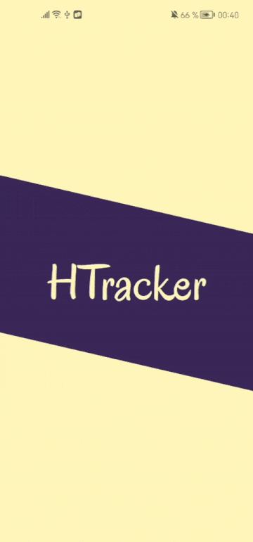

# Habit Tracker

## Описание
- Отслеживание ежедневных привычек
- Создание и настройка привычек вручную или на основе шаблонов
- Мониторинг прогресса, просмотр истории и статистики
- Поддержка светлой и тёмной темы
- Локализация: русский и английский языки

## Демо

## Стек
- **Архитектура:** Clean Architecture, MVI
- **Сеть:** Retrofit
- **Хранение данных:** Room
- **Внедрение зависимостей:** Dagger 2
- **UI:** Jetpack Compose, Accompanist  
